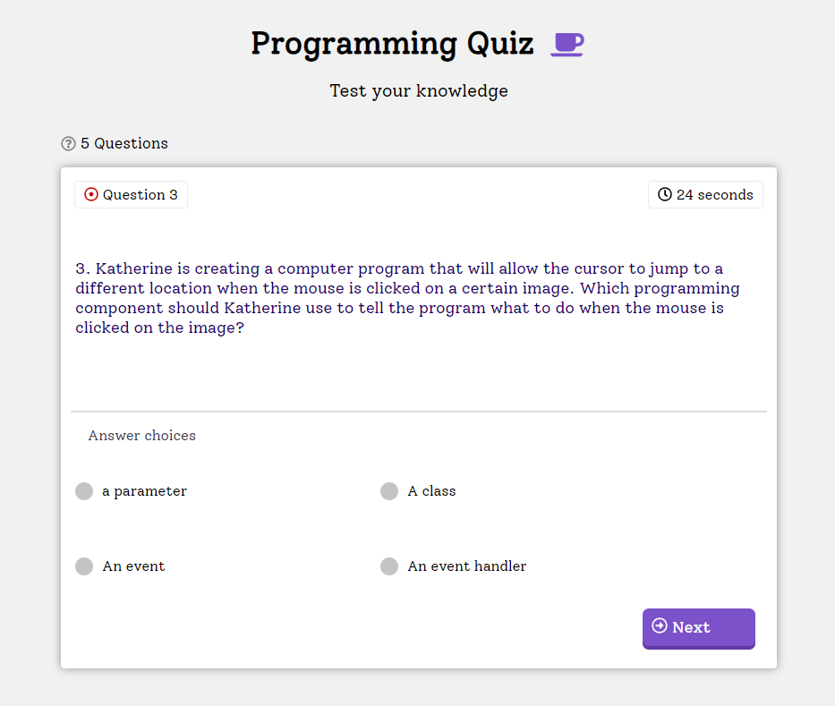

# programming-quiz
A programming quiz made with HTML, CSS and JS (jQuery).

## PC

## About this Project

This project was carried out with the intention of integrating HTML, CSS, JavaScript and, mainly, jQuery technologies.

I will be very happy if you can provide me with any feedback on the project, code, structure or anything you can report that can make me a better developer!

Send me an email: g2_ribeiro@hotmail.com

Connect with me on [LinkedIn](https://www.linkedin.com/in/gustavo-ribeiro-488b4a17a/)

## How to run the project

To run the project, just open the index.html.
